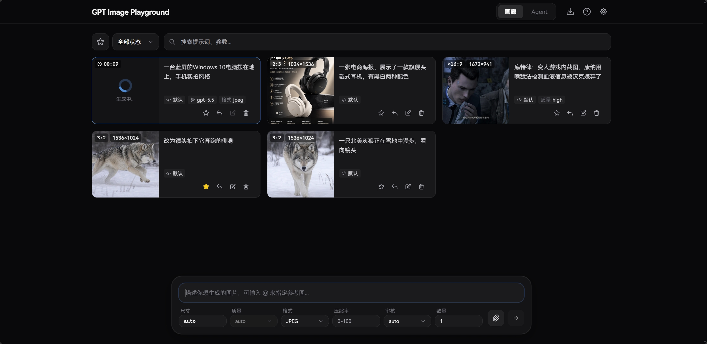
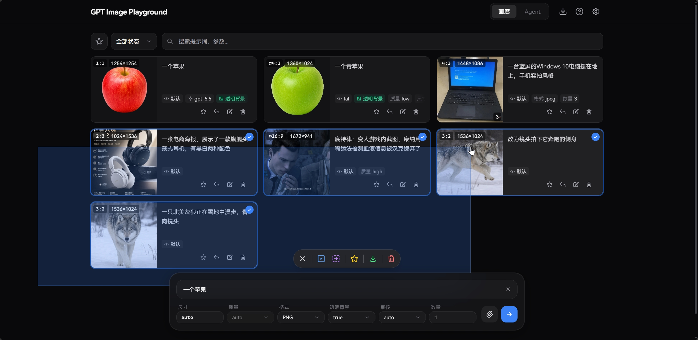
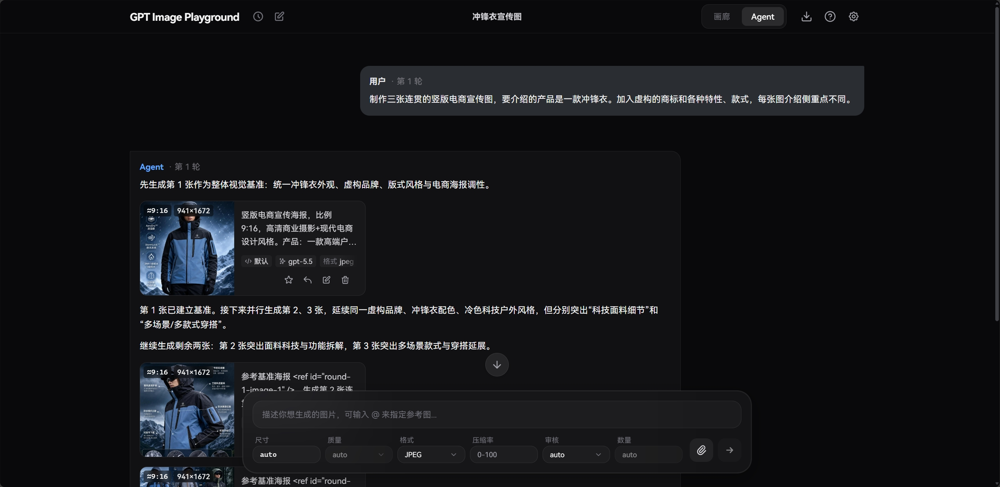
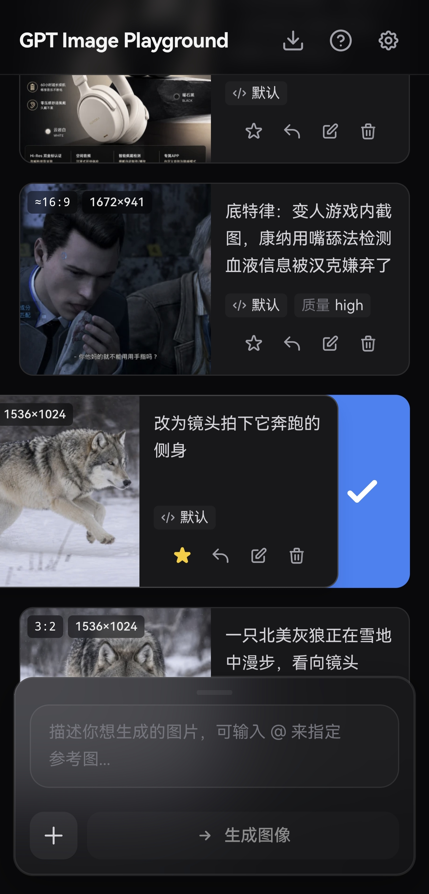

<div align="center">

# 🎨 GPT Image Studio

[](https://github.com/88lin/gpt-image-studio/stargazers)
[](https://github.com/88lin/gpt-image-studio/network/members)
[](LICENSE)
[](https://react.dev/)
[](https://www.typescriptlang.org/)
[](https://vite.dev/)
[](https://tailwindcss.com/)

**基于 OpenAI gpt-image-2 API 的图片生成、编辑与提示词工作台**

提供简洁精美的 Web UI，支持 OpenAI / OpenAI 兼容接口、fal.ai 与可导入的自定义 HTTP 供应商。<br>
支持文本生图、参考图与遮罩编辑，数据纯本地化存储，带来流畅的历史记录与参数管理体验。

<br>

[](https://88lin.github.io/gpt-image-studio)
&nbsp;&nbsp;&nbsp;
[](https://gpt-image-2.88lin.eu.org/)

</div>

<br>

> [!TIP]
> 若需调用非 HTTPS 的内网或本地 HTTP API，请使用 GitHub Pages 版本或自行部署，Vercel 部署的体验版绑定的 `.dev` 域名因安全策略通常要求接口必须为 HTTPS。

## 🌟 二次开发增强

本项目基于 [GPT Image Playground](https://github.com/CookSleep/gpt_image_playground) 二次开发，额外增加了以下功能：

- **570+ 内置提示词模板**：聚合三个中文提示词来源，支持按标题、描述、来源和标签搜索，一键套用：
  - [EvoLinkAI/awesome-gpt-image-2-prompts](https://github.com/EvoLinkAI/awesome-gpt-image-2-prompts) — 199 个 GPT-Image-2 实用案例
  - [prompts.kkkm.cn](https://prompts.kkkm.cn/) — 274 个高质量中文提示词
  - 厚十方精选 — 97 个电商 / 海报 / 封面 / 产品图模板
- **提示词模板库弹窗**：独立 UI 组件，支持分类浏览、关键词检索、示例图预览和一键填入输入框
- **移除上游赞助弹窗**：去掉原项目的赞助提示，界面更干净
- **焦点管理优化**：打开 / 关闭弹窗时自动释放焦点，避免移动端键盘残留

## 💖 赞助商

<table>
<tr>
<td width="180" align="center" valign="middle">
  <a href="https://agentrouter.org/register?aff=ugVO"></a>
</td>
<td valign="middle"><b><a href="https://agentrouter.org/register?aff=ugVO">Agent Router</a></b>&nbsp;是免费公益大模型API平台，支持GPT-5.6、Claude Opus 5 等主流模型，国内直连。注册送＄175（每日签到得＄25，被邀得＄50），支持GitHub/LinuxDo登录。</td>
</tr>
<tr>
<td width="180" align="center" valign="middle">
  <a href="https://www.sheapi.top/sign-up?aff=MvcR"></a>
</td>
<td valign="middle"><b><a href="https://www.sheapi.top/sign-up?aff=MvcR">SheApi</a></b>&nbsp;是一家可靠高效的 API 中转服务提供商，主要提供 Claude Code、Codex 等主流模型的高稳定中转能力，Codex 倍率补贴低至 0.06，GPT-Image-2生图每张0.04。受邀注册送$1 体验金，每日签到还可领取专属免费额度。</td>
</tr>
<tr>
<td width="180" align="center" valign="middle">
  <a href="https://www.workbuddy.cn/events/invite?inviteCode=w0x2ic45z"></a>
</td>
<td valign="middle"><b><a href="https://www.workbuddy.cn/events/invite?inviteCode=w0x2ic45z">WorkBuddy</a></b>&nbsp;是腾讯出品的全能 AI 工作台，是中国最受欢迎的效率 AI 智能体服务，说出要求、开始执行任务、交付完整成果。其中Hy3模型限时免费使用，注册即可获取2000积分，每月再赠送500积分，可用Kimi-K3、GLM-5.2等模型。</td>
</tr>
<tr>
<td width="180" align="center" valign="middle">
  <a href="https://seekai.cc/sign-up?aff=Plh5"></a>
</td>
<td valign="middle"><b><a href="https://seekai.cc/sign-up?aff=Plh5">SeekAi</a></b>&nbsp;是免费公益大模型API平台，可用claude-fable-5、Claude-Opus-5、kimi-k3、gpt-5.6-sol、glm-5.2、DeepSeek-V4-Flash-0731等主流模型，目前较稳定。注册送＄200，每日签到得＄20，支持GitHub登录。</td>
</tr>
</table>

---

## 📸 界面预览

<details>
<summary><b>点击展开截图展示</b></summary>
<br>

<div align="center">
  <b>桌面端主界面</b><br>
  
</div>

<br>

<div align="center">
  <b>任务详情与实际参数</b><br>
  
</div>

<br>

<div align="center">
  <b>桌面端批量选择</b><br>
  
</div>

<br>

<div align="center">
  <b>桌面端 Agent 模式</b><br>
  
</div>

<br>

<div align="center">
  <b>移动端主界面</b><br>
  
</div>

<br>

<div align="center">
  <b>移动端侧滑多选</b><br>
  
</div>

</details>

## ✨ 核心特性

### 🎨 强大的图像生成与编辑
- **参考图与遮罩**：支持上传最多 16 张参考图（支持剪贴板和拖拽）。内置可视化遮罩编辑器，自动预处理以符合官方分辨率限制。
- **批量与迭代**：支持单次多图生成；一键将满意结果转为参考图，无缝开启下一轮修改。
- **流式生成预览**：`Images API` 与 `Responses API` 模式均支持流式接收中间步骤图像，缓解连接超时问题。
- **透明背景（API 原生 / 本地后处理双模式）**：画廊模式下选择 PNG 或 WebP 格式后可开启透明背景功能，每个 API 配置可独立选择实现方式（设置入口在 API 配置页）。API 原生模式会直接请求模型返回透明通道（需当前接口和模型支持；fal.ai 暂无对应参数），本地后处理模式则会要求模型使用纯绿色或纯洋红色背景，并在结果返回后于浏览器中去除背景色，按所选 PNG 或 WebP 格式保存透明结果。

  > [!NOTE]
  > 本地后处理流程适用于图标、贴纸、单主体素材等场景；若主体边缘存在复杂发丝、半透明材质、强反光或与背景色接近的颜色，可能出现边缘残留或误抠。若使用 API 原生模式时接口返回“不支持透明背景”类错误，应用会提示切换为本地后处理。

### 🧠 提示词模板库
- **570+ 内置精选模板**：聚合 prompts.kkkm.cn、awesome-gpt-image-2-prompts、厚十方精选三个中文提示词来源，覆盖电商图、海报、封面、产品图、摄影风格和视觉概念图等场景。
- **搜索与套用**：支持按标题、描述、来源和标签检索，一键填入输入框并继续二次编辑。
- **示例图辅助判断**：部分模板保留示例图，便于快速判断构图、画风和适用场景。

### 🤖 Agent 多轮对话模式
- **多轮对话与上下文记忆**：基于 Responses API 的对话式生成，Agent 会理解上下文并按需调用图像工具；支持 `@` 引用参考图或前面轮次生成的图片，并自动识别上下文中的图片。
- **并发批量生成**：内置 `generate_image_batch` 工具，让 Agent 在一次轮次中并发生成多张关联图像，并通过 `continue_generation` 自动追加新一轮以处理依赖关系。
- **分支与重新生成**：编辑某轮消息重新发送或重新生成某轮消息会产生可切换的分支，引用解析严格限定在当前分支路径内，避免误用其他分支的图片。
- **画廊同步与隔离删除**：Agent 生成的图片会同步到画廊；删除对话默认保留画廊记录，删除画廊任务时也会自动清理对话中残留的图片引用。
- **可选 Web 搜索**：可开启 `web_search` 工具，Agent 会在需要时搜索网络信息并附带引用链接。

### ⚙️ 精细化参数追踪
- **智能尺寸控制**：提供 1K/2K/4K 快速预设，自定义宽高时会自动规整至模型安全范围（16 的倍数、总像素校验等）。
- **实际参数对比**：自动提取 API 响应中真实生效的尺寸、质量、耗时以及**模型改写后的提示词**，与你的请求参数高亮对比。支持定制化的参数列表横向平滑滚动体验。

### 📁 高效历史管理 (纯本地)
- **瀑布流与画廊**：历史任务自动保存，支持按状态过滤、全屏大图预览与快捷下载。
- **多收藏夹管理**：支持创建多个命名收藏夹，同一任务可归入多个收藏夹。提供独立的收藏夹概览视图（展示封面缩略图与任务数量），点击进入具体收藏夹后仍可叠加搜索与状态筛选。收藏夹支持拖拽排序、重命名、设置默认收藏夹，以及按收藏夹为单位批量打包下载 ZIP。
- **快捷批量操作**：桌面端支持鼠标拖拽框选、Ctrl/⌘ 连选，移动端支持顺滑侧滑多选；轻松实现批量收藏与清理。
- **优化的图片查看与下载**：大图预览支持左右滑动切换、移动端长按弹出操作菜单，支持快捷下载与批量下载。
- **极致性能与隐私**：所有记录与图片均存放在浏览器 IndexedDB 中（采用 SHA-256 去重压缩），不经过任何第三方服务器。支持一键打包导出 ZIP 备份。

### 🔌 多配置与供应商增强
- **多配置管理**：支持创建并保存多个 API 配置（包含供应商、API Key、模型等），按需快速切换；支持一键复制当前配置到列表底部，并通过拖拽对配置列表与供应商列表进行自定义排序。
- **多供应商接入**：内置 OpenAI 兼容接口（含 `Images API` 和 `Responses API`）、fal.ai（支持队列），并支持通过 JSON 导入自定义 HTTP 供应商配置（兼容同步/异步任务）。
- **Agent 模式独立 API 配置**：支持为 Agent 模式使用原生（Response API）或混合（Response API + Image API）的独立 API 配置，解决部分供应商/模型不支持 `image_generation` 工具的问题。
- **API 代理**：OpenAI 兼容接口与 fal.ai 均可配置自定义代理。其中 OpenAI 兼容接口可开启同源 `/api-proxy/` 代理，交由 Docker 或本地开发环境转发至真实 API，绕开浏览器 CORS 限制。
- **Codex CLI 兼容模式**：对上游为 Codex CLI 的 API，开启后应用 Codex CLI 实际支持的参数，并将多图生成拆分为并发单图。
- **提示词防改写**：Responses API 会始终在请求文本前加入强制指令防止提示词被改写；开启 Codex CLI 模式后，Images API 也会获得同等保护。
- **智能诊断提示**：当检测到接口异常改写行为或缺少常规参数时，自动提示开启相应的兼容模式。
- **习惯配置**：支持设置提交后清空输入、重启后保留历史输入、临时复用历史任务 API 配置、关闭提示词防改写等。

---

## 🚀 部署与使用

支持多种部署与开发方式。

<a id="preset-config"></a>
### 预置配置说明

所有部署方式都可以通过环境变量提供"预置配置"——部署端预先加入用户配置列表的 API 配置。用户打开页面时会自动看到这些配置，无需手动创建，格式和用户自己创建的配置完全一致。

环境变量的值支持三种填写方式：

| 填写方式 | 说明 | 示例 |
|------|------|------|
| **直接填写 API 地址** | 自动创建一个 OpenAI 兼容的默认预置配置（ID 为 `default-openai`）并注入 API URL，其余参数（模型、超时等）使用应用默认值，用户只需补充 API Key。末尾带 `/` 时直接拼接接口，不补 `/v1` 前缀。适合只提供一个配置的部署。后续如需通过 JSON 或链接更新此配置，指定 `id` 为 `default-openai` 即可。 | `https://api.openai.com/v1` |
| **API 地址 + 查询参数** | 在地址后追加参数，可同时预填 Key、模型等字段。 | `https://api.openai.com/v1?model=gpt-image-2&apiMode=responses` |
| **JSON 配置文件 / 导入链接** | 通过仓库内或本地的 JSON 文件路径（如 `./config.json`）、远程 URL 或含 `?settings=` 参数的导入链接提供完整预置配置，支持预置多个配置（OpenAI 兼容、fal.ai 或自定义供应商）。 | 详见 [预置配置 JSON 格式](#preset-config-json) |

**环境变量一览**

部署时可以通过设置环境变量来控制预置配置和客户端行为。有关 Docker 专属的网络与代理配置（如 `ENABLE_API_PROXY` 等），请参考下方的 [Docker 部署](#docker-deployment) 章节。

| 构建时变量 (Vercel/CF/本地) | Docker 运行变量 | 功能说明 |
|------|------|------|
| `VITE_DEFAULT_API_URL` | `DEFAULT_API_URL` | 设定预置配置值（支持 URL 形式或 JSON 格式，详见 [预置配置 JSON 格式](#preset-config-json)） |
| `VITE_LOCK_PRESET_CONFIG_PARAMS=true` | `LOCK_PRESET_CONFIG_PARAMS=true` | 锁定预置配置中除 API Key 外的参数，并禁止编辑预置供应商定义；当前锁定配置引用的供应商不可删除，解除引用后可删除 |
| `VITE_PREVENT_PRESET_CONFIG_DELETION=true` | `PREVENT_PRESET_CONFIG_DELETION=true` | 禁止删除预置配置和预置供应商，不锁定参数；普通项不受影响 |
| `VITE_SHOW_PRESET_CONFIG_ONLY=true` | `SHOW_PRESET_CONFIG_ONLY=true` | 只允许使用当前预置配置，禁止创建、复制、删除、拖动、切换供应商和管理自定义供应商；未同时开启锁定时参数仍可编辑，API Key 始终可编辑 |

> [!NOTE]
> **未开启上述限制时的默认行为**：
> - **参数更新**：API 地址、模型、超时等参数会与上一次部署快照比较；部署值发生变化时覆盖一次本地值，之后保留用户的本地修改，直到部署值再次变更。
> - **API Key**：始终由用户在本地管理，重新部署不覆盖。
> - **排序与删除**：预置配置可拖动；预置配置和预置供应商均允许删除，删除状态保存在浏览器中，重新部署不会恢复。
> - **下线预置清理**：部署端移除某个预置后，若用户从未修改过该配置且没有历史生成任务引用，会自动从本地删除；若已被修改或仍被历史任务引用，则保留并转为普通配置。
> - **失效供应商清理**：随预置引入的自定义供应商在不再被任何配置使用、且从未被用户修改时，也会自动清理。

> [!NOTE]
> 兼容提示：旧变量 `VITE_SHOW_DEFAULT_CONFIG_ONLY`／`SHOW_DEFAULT_CONFIG_ONLY` 仍可使用，等同于对应的 `SHOW_PRESET_CONFIG_ONLY`。

### 部署方式

<details>
<summary><strong>▲ 方式一：Vercel 一键部署 (推荐)</strong></summary>

支持通过 Vercel 一键导入 GitHub 仓库并自动完成构建部署。

**预置配置**

在 Vercel 项目的 **Settings → Environment Variables** 中设置 `VITE_DEFAULT_API_URL`，支持上述三种填写方式，可直接填写 API 地址或指定配置文件路径（如仓库内的 [`gpt-image-config.example.json`](gpt-image-config.example.json) 模板）。详见 [预置配置说明](#preset-config)。

```dotenv
VITE_DEFAULT_API_URL=https://api.openai.com/v1
```

**部署**

[](https://vercel.com/new/clone?repository-url=https%3A%2F%2Fgithub.com%2F88lin%2Fgpt-image-studio&project-name=gpt-image-studio&repository-name=gpt-image-studio)

点击上方按钮导入仓库即可，Vercel 会自动执行构建并部署静态文件。

**绑定自定义域名 (国内直连)**：Vercel 默认分配的 `.vercel.app` 域名在国内通常无法直接访问。如果你希望在国内直连访问，请在 Vercel 项目的 **Settings → Domains** 中绑定你自己的域名。

**配置自动更新**：

本项目默认开启 Vercel 自动部署，每次推送 `main` 分支都会自动触发构建。若希望仅在上游发布正式版本时才部署，可在 `vercel.json` 中将 `deploymentEnabled` 改为 `false`，然后配置 Deploy Hook：

1. 在 Vercel 项目设置 **Settings -> Git** 的 **Deploy Hooks** 中创建一个名为 `Release` 的 Hook（Branch 填 `main`）并复制生成的 URL。
2. 在你 Fork 的 GitHub 仓库设置 **Settings -> Secrets and variables -> Actions** 中，新建 Secret `VERCEL_DEPLOY_HOOK`，填入刚才的 URL。

此后，只有在本仓库发布了正式版本（即包含新 Release / 版本号变动）时，在你的 Fork 页面点击 **Sync fork** 才会自动触发 Vercel 构建部署；日常的普通代码提交不会触发部署。

</details>

<details>
<summary><strong>🌐 方式二：GitHub Pages 部署</strong></summary>

支持通过 GitHub Actions 工作流将静态页面一键发布至 GitHub Pages。

**预置配置**

在仓库 **Settings → Secrets and variables → Actions** 中添加 Secret `VITE_DEFAULT_API_URL`，支持上述三种填写方式，可直接填写 API 地址或指定配置文件路径（如仓库内的 [`gpt-image-config.example.json`](gpt-image-config.example.json) 模板）。详见 [预置配置说明](#preset-config)。

```dotenv
VITE_DEFAULT_API_URL=https://api.openai.com/v1
```

**部署**

1. 在 GitHub 仓库的 **Settings → Pages** 中，将 **Build and deployment → Source** 设置为 **GitHub Actions**。
2. 进入仓库顶部的 **Actions** 标签页，在左侧工作流列表中选择 **Deploy to GitHub Pages**。
3. 点击右侧的 **Run workflow** 下拉按钮，分支选择 `main`，然后点击绿色的 **Run workflow** 按钮开始构建部署。

</details>

<details>
<summary><strong>☁️ 方式三：Cloudflare Workers 部署</strong></summary>

支持通过内置的 Wrangler 配置将构建产物作为静态资源部署至 Cloudflare Workers。

**预置配置**

在执行构建前设置环境变量 `VITE_DEFAULT_API_URL`，支持上述三种填写方式，可直接填写 API 地址或指定配置文件路径（如仓库内的 [`gpt-image-config.example.json`](gpt-image-config.example.json) 模板）。Cloudflare Workers 不会在部署后改写静态文件，因此必须在构建前完成设置。详见 [预置配置说明](#preset-config)。

```dotenv
VITE_DEFAULT_API_URL=https://api.openai.com/v1
```

**部署**

**1. 登录 Cloudflare**

```bash
npx wrangler login
```

**2. 部署到 Workers**

```bash
npm run deploy:cf
```

部署脚本会先执行 `npm run build`，再通过 `wrangler deploy` 上传 `dist/` 目录。

</details>

<a id="docker-deployment"></a>
<details>
<summary><strong>🐳 方式四：Docker 部署</strong></summary>

支持通过官方发布的 Docker 镜像在服务器或本地容器环境中快速运行。

**环境变量**

| 变量 | 说明 |
|------|------|
| `DEFAULT_API_URL` | 预置配置，支持上述三种填写方式。若值指向 `.json` 文件或容器内路径，容器启动时自动读取并内嵌到页面。宿主机文件需通过 volume 挂载。详见 [预置配置说明](#preset-config) |
| `ENABLE_API_PROXY=true` | 开启 Nginx 同源代理，请求发往 `/api-proxy/{路径}` 再转发到 `API_PROXY_URL` |
| `API_PROXY_URL` | 代理转发的完整 API 基础地址（不自动补 `/v1`） |
| `LOCK_API_PROXY=true` | 强制锁定代理为开启，用户无法关闭 |
| `HOST` / `PORT` | Nginx 监听地址和端口，默认 `0.0.0.0:80` |

> [!WARNING]
> 开启 API 代理后，任何人都能将你的服务器作为代理来请求目标 API。建议仅在有访问控制（如 IP 白名单）或本地网络中开启。

> [!NOTE]
> 旧版 `API_URL` 已拆分为 `DEFAULT_API_URL` 和 `API_PROXY_URL`，容器启动时自动兼容，无需立即修改。

**隐藏真实 API 地址**

配合 `ENABLE_API_PROXY=true` + `LOCK_API_PROXY=true` 可隐藏上游地址：

- OpenAI 兼容接口：`DEFAULT_API_URL` 留空或填占位地址（如 `https://proxy`）。
- 自定义供应商：JSON 中配置的 `baseUrl` 留空并设置 `apiProxy: true`（仅支持同步配置）。

用户只能看到空值或占位地址，真实地址仅存在于 `API_PROXY_URL`。

**Docker CLI 示例**

如果你已将镜像发布到 `ghcr.io/88lin/gpt-image-studio:latest`，可按下面方式运行：

```bash
docker run -d -p 8080:80 \
  -e DEFAULT_API_URL=https://api.openai.com/v1 \
  ghcr.io/88lin/gpt-image-studio:latest
```

开启代理并隐藏真实地址：

```bash
docker run -d -p 8080:80 \
  -e DEFAULT_API_URL= \
  -e API_PROXY_URL=https://real-api.example.com/v1 \
  -e ENABLE_API_PROXY=true \
  -e LOCK_API_PROXY=true \
  ghcr.io/88lin/gpt-image-studio:latest
```

挂载本地配置文件：

```bash
docker run -d -p 8080:80 \
  -v ./gpt-image-config.json:/config/gpt-image-config.json:ro \
  -e DEFAULT_API_URL=/config/gpt-image-config.json \
  ghcr.io/88lin/gpt-image-studio:latest
```

使用 host 网络加 `--network host`，修改端口用 `-e PORT=28080`。

**Docker Compose 示例**

```yaml
services:
  gpt-image-studio:
    image: ghcr.io/88lin/gpt-image-studio:latest
    environment:
      - DEFAULT_API_URL=https://api.openai.com/v1
    ports:
      - "8080:80"
    restart: unless-stopped
```
**更新说明：**

使用 `latest` 标签时，重新拉取镜像并重启即可更新（如 `docker compose pull && docker compose up -d`）。若你没有发布自己的镜像，也可以直接使用 `npm run build` 生成静态产物后部署。

</details>

<details>
<summary><strong>💻 方式五：本地开发与静态构建</strong></summary>

支持在本地通过 Node.js 环境运行开发服务器或构建生产静态文件。

**1. 预置配置（可选）**

在项目根目录新建 `.env.local` 文件，设置 `VITE_DEFAULT_API_URL`，支持上述三种填写方式，可直接填写 API 地址或指定配置文件路径（如仓库内的 [`gpt-image-config.example.json`](gpt-image-config.example.json) 模板）。详见 [预置配置说明](#preset-config)。

开发服务器启动或构建时若值指向远程 `.json` 文件或本地路径，内容会自动内嵌到页面。

```dotenv
VITE_DEFAULT_API_URL=https://api.openai.com/v1
```

**2. 安装依赖并启动**

```bash
npm install
npm run dev
```

**3. 本地开发跨域代理 (可选)**

如果在本地开发时遇到浏览器的 CORS 限制，可开启本地代理转发：

```bash
cp dev-proxy.config.example.json dev-proxy.config.json
```

修改 `dev-proxy.config.json`，将 `target` 设置为真实的完整 API 基础地址。代理不会自动补 `/v1`，OpenAI 兼容接口通常必须填写到版本前缀，如 `https://api.example.com/v1`。重启开发服务器后，在页面设置中开启 **API 代理** 即可（请求将被转发如 `http://localhost:5173/api-proxy/... -> target/...`）。此功能仅在 `npm run dev` 阶段生效，不会影响打包产物。

**4. 本地故障模拟 API (可选)**

如果需要复现图片 URL 跨域、接口返回结构异常、原始响应查看等问题，可启动内置模拟服务：

```powershell
npm run mock:api
```

使用方式见 [本地故障模拟 API](docs/mock-image-api.md)。

**5. 构建静态产物**

```bash
npm run build
```

构建输出的文件位于 `dist/` 目录下，可将其部署至任何静态文件服务器（如普通 Nginx、GitHub Pages、Netlify 等）。

</details>

---

<a id="url-quick-fill"></a>
## 🛠️ URL 传参快速填充

通过 URL 查询参数快速填入 OpenAI 兼容配置，适合创建书签或集成分享。

| 参数 | 说明 | 示例 |
|------|------|------|
| `apiUrl` | API Base URL | `?apiUrl=https://api.example.com/v1` |
| `apiKey` | API Key | `?apiKey=sk-xxxx` |
| `model` | 模型 ID（未传时按 apiMode 使用默认模型） | `?model=gpt-image-2` |
| `apiMode` | `images` 或 `responses`，默认 `images` | `?apiMode=responses` |
| `profileName` | 配置名称，默认"URL 参数配置" | `?profileName=我的配置` |
| `reasoningEffort` | Responses API 推理强度 | `?reasoningEffort=high` |
| `codexCli` | Codex CLI 兼容模式 | `?codexCli=true` |
| `streamImages` | 流式传输 | `?streamImages=true` |
| `streamPartialImages` | 中间步骤图像数（需配合 streamImages） | `?streamPartialImages=2` |
| `profileId` | 目标配置 ID；匹配到同 ID 配置时直接更新 | `?profileId=my-service` |
| `transparentBackgroundMethod` | 透明背景实现方式：`api`（原生）或 `local`（本地后处理） | `?transparentBackgroundMethod=local` |

集成示例（New API 聊天系统）：

```text
https://gpt-image-2.88lin.eu.org/?apiUrl={address}&apiKey={key}&model={model}
```

```text
https://88lin.github.io/gpt-image-studio?apiUrl={address}&apiKey={key}&model={model}
```

**自定义格式供应商**
如果需要导入自定义格式的 API 配置，请使用 `settings` 参数并传入 URL 编码后的完整 JSON：
- `?settings={URL编码后的JSON}`（只读取 `customProviders` 和 `profiles` 列表）

> [!TIP]
> 推荐先在项目内完成配置生成与导入：
>
> **设置 - API 配置 - 供应商类型 - 创建自定义供应商 - AI 一键生成与导入**
>
> 完成后可在 **API 配置 - 当前配置** 使用右侧快捷按钮：
>
> - **链接按钮**：复制可导入配置的 URL。复制时可选择不包含 API Key，并使用 `{address}`、`{key}`、`{model}` 等变量，便于在 New API 等平台中集成分享。
> - **复制按钮**：将当前配置复制一份到配置列表底部，新配置名称会追加“（复制）”。

JSON 结构示例：

```json
{
  "customProviders": [
    {
      "id": "custom-example-task",
      "name": "示例异步任务供应商",
      "submit": {
        "path": "images/generations",
        "method": "POST",
        "contentType": "json",
        "body": {
          "model": "$profile.model",
          "prompt": "$prompt",
          "size": "$params.size",
          "quality": "$params.quality",
          "output_format": "$params.output_format",
          "output_compression": "$params.output_compression",
          "n": "$params.n",
          "image_urls": "$inputImages.dataUrls"
        },
        "taskIdPath": "data.0.task_id"
      },
      "poll": {
        "path": "tasks/{task_id}",
        "method": "GET",
        "intervalSeconds": 5,
        "statusPath": "data.status",
        "successValues": ["completed"],
        "failureValues": ["failed", "cancelled"],
        "errorPath": "data.error.message",
        "result": {
          "imageUrlPaths": ["data.result.images.*.url.*"],
          "b64JsonPaths": []
        }
      }
    }
  ],
  "profiles": [
    {
      "id": "example-profile",
      "name": "示例异步任务供应商",
      "provider": "custom-example-task",
      "baseUrl": "https://api.example.com/v1",
      "model": "gpt-image-2",
      "apiMode": "images"
    }
  ]
}
```

示例中的 `example-profile` 是唯一配置，因此自动成为默认预置配置。若添加更多配置，需要为其中一项设置 `isDefault: true`。

---

<a id="preset-config-json"></a>
## 📋 预置配置 JSON 格式

使用 JSON 文件或分享链接提供预置配置时，JSON 对象包含两个顶层字段：

- **`customProviders`**（数组）：自定义供应商定义。如果只用 OpenAI 兼容或 fal.ai，此数组留空 `[]` 即可。
- **`profiles`**（数组）：预置的 API 配置列表。每项对应用户配置页中的一个配置条目。

### 配置列表字段说明（`profiles`）

| 字段 | 必填 | 说明 |
|------|------|------|
| `id` | 定向更新时填写 | 用于标识配置条目：若后续链接携带相同 ID（查询参数 `profileId`、`settings` 链接或预置配置 JSON 中的 `id`），将直接更新该条目而非新建。应用内普通分享链接会省略此字段。 |
| `name` | 是 | 配置名称，方便用户识别。 |
| `description` | 否 | 配置说明，支持 Markdown；填写后会以说明卡片显示在"当前配置"下方。文本可选中和复制，其中的链接可点击。 |
| `provider` | 是 | 供应商类型。`"openai"` 为 OpenAI 兼容接口，`"fal"` 为 fal.ai，其他值引用 `customProviders` 中具有相同 ID 的供应商定义。 |
| `baseUrl` | 是 | API 基础地址（Base URL）。未以 `/` 结尾时遵循 OpenAI 规则自动补齐 `/v1` 前缀；以 `/` 结尾时直接基于该地址请求接口，不补 `/v1`；fal.ai 可留空。 |
| `apiKey` | 否 | API Key。建议省略，让用户导入后自行填写。 |
| `model` | 是 | 默认模型 ID。 |
| `apiMode` | 否 | `"images"` 或 `"responses"`，默认 `"images"`。 |
| `isDefault` | 否 | 有多个配置时，为默认项设置 `true`（只能有一个）；只有一个配置时不填。默认项决定首次使用时自动选中的配置；允许拖动排序和删除（受保护策略控制）。 |
| `timeout` | 否 | 请求超时秒数，默认 600。 |
| `apiProxy` | 否 | 是否走部署端 API 代理，默认 `false`。 |
| `transparentBackgroundMethod` | 否 | 透明背景实现方式：`"api"`（API 原生）或 `"local"`（本地后处理）。OpenAI 兼容配置默认 `"api"`，fal.ai 默认 `"local"`，自定义服务商若生成和编辑请求都映射了 `$params.background` 模板变量则默认 `"api"`，否则默认 `"local"`。 |

### 示例：仅 OpenAI 兼容

```json
{
  "customProviders": [],
  "profiles": [
    {
      "id": "my-openai",
      "name": "我的 OpenAI 配置",
      "description": "使用前请阅读 [接口说明](https://example.com/docs)。",
      "provider": "openai",
      "baseUrl": "https://api.openai.com/v1",
      "model": "gpt-image-2"
    }
  ]
}
```

### 示例：OpenAI 兼容 + fal.ai 多配置

```json
{
  "customProviders": [],
  "profiles": [
    {
      "id": "openai-main",
      "name": "OpenAI",
      "provider": "openai",
      "baseUrl": "https://api.openai.com/v1",
      "model": "gpt-image-2",
      "isDefault": true
    },
    {
      "id": "fal-profile",
      "name": "fal.ai",
      "provider": "fal",
      "baseUrl": "",
      "model": "openai/gpt-image-2"
    }
  ]
}
```

### 如何将预置配置提供给环境变量

预置配置 JSON 可以通过以下三种方式填入部署环境变量（`VITE_DEFAULT_API_URL` 或 Docker 的 `DEFAULT_API_URL`）：

**1. 导入链接（单配置导入，最简单）**

在项目的 [Vercel 在线体验](https://gpt-image-2.88lin.eu.org/) 或 [GitHub Pages 在线体验](https://88lin.github.io/gpt-image-studio) 中配置好某个条目后，点击"链接"按钮复制含 `?settings=` 参数的 URL（请勿勾选任何"New API 变量配置"选项），直接填入环境变量即可。

> [!TIP]
> 页面中的"复制导入配置 URL"按钮导出的是**当前选中的单个配置**及其关联的自定义供应商。如需一次性预置包含多个供应商的列表，请使用下方的本地/仓库文件或远程 URL 方式。

```dotenv
VITE_DEFAULT_API_URL=https://你的域名?settings=%7B%22customProviders%22%3A%5B...%5D%2C%22profiles%22%3A%5B...%5D%7D
```

**2. 仓库内／本地配置文件（推荐）**

支持直接指定仓库根目录或本地文件相对路径（如 `./gpt-image-config.example.json` 或 `./config/my-presets.json`），构建时会自动读取并内嵌到静态页面中。

```dotenv
VITE_DEFAULT_API_URL=./gpt-image-config.example.json
```

Docker 需要通过 volume 挂载宿主机文件到容器内路径：

```bash
docker run -d -p 8080:80 \
  -v ./gpt-image-config.json:/config/gpt-image-config.json:ro \
  -e DEFAULT_API_URL=/config/gpt-image-config.json \
  ghcr.io/88lin/gpt-image-studio:latest
```

> [!NOTE]
> Docker 环境变量名为 `DEFAULT_API_URL`（不含 `VITE_` 前缀）。

**3. HTTP／HTTPS 远程配置文件**

将 JSON 保存到部署服务器能够访问的 URL（可位于内网，不要求用户浏览器能访问）。构建时或容器启动时会自动读取并内嵌到页面。

```dotenv
VITE_DEFAULT_API_URL=https://example.com/gpt-image-config.json
```

---

## ⭐ Star History

<picture>
  <source media="(prefers-color-scheme: dark)" srcset="https://raw.githubusercontent.com/88lin/gpt-image-studio/star-history/assets/my-star-history/star-history-dark.svg">
  
</picture>

---

## 📄 许可证

本项目基于 [MIT License](LICENSE) 开源。
